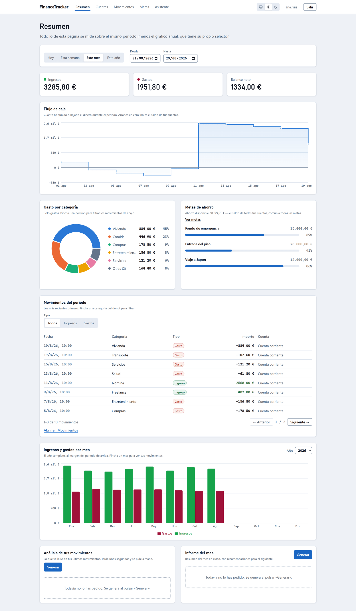
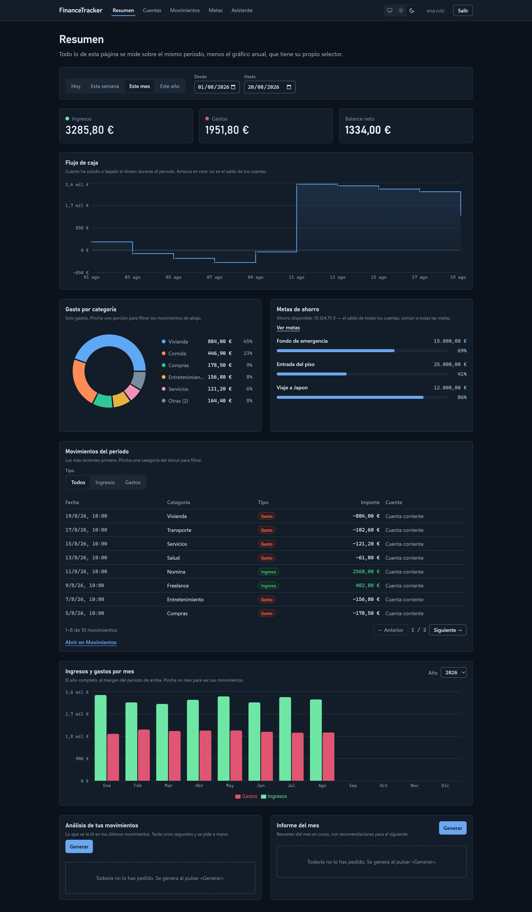
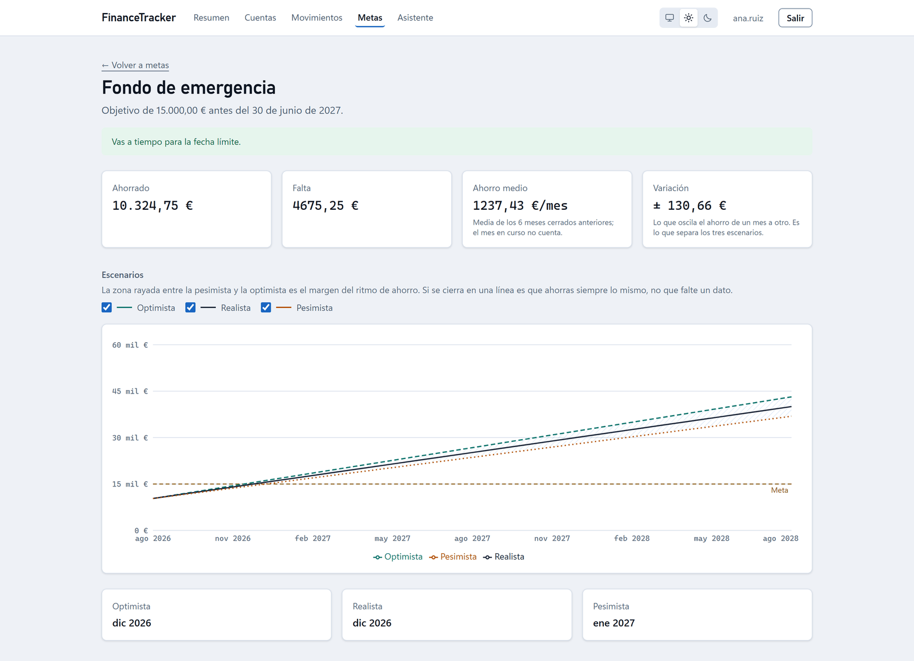
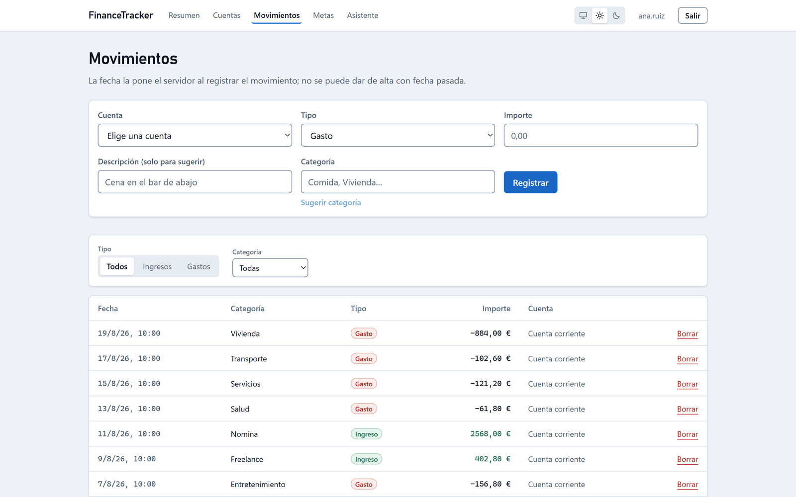
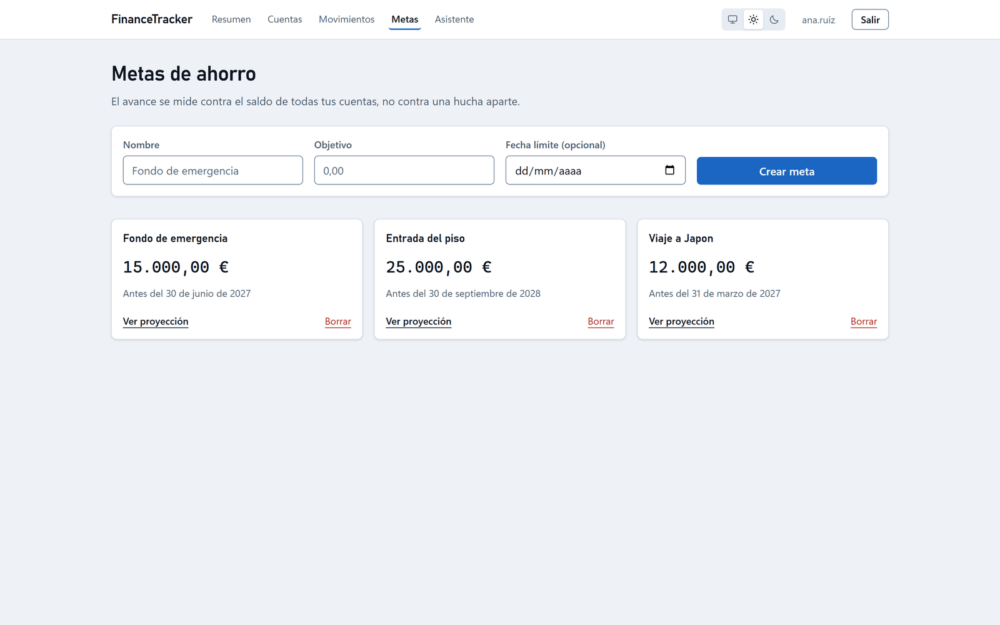
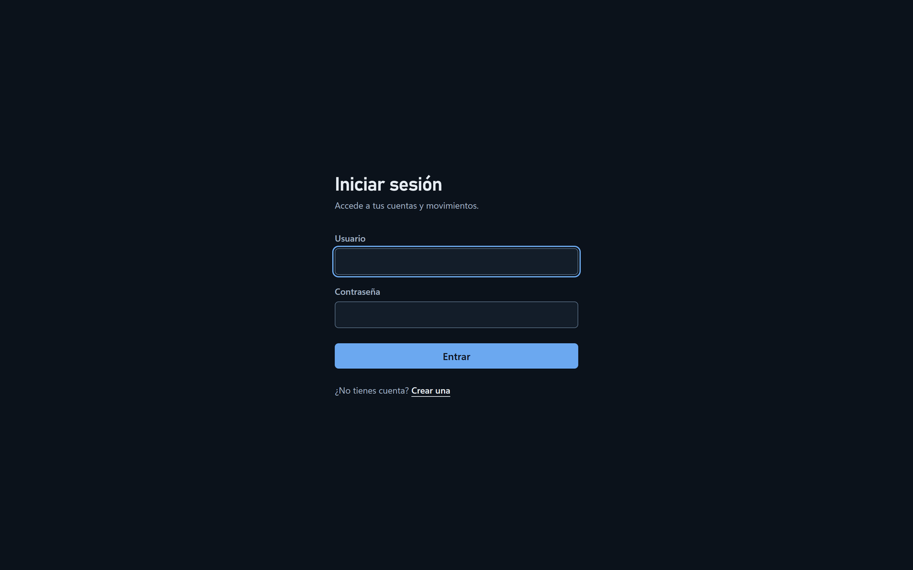

# 💼🤖 FinanceTracker

Gestión de finanzas personales con Spring Boot, React y un asistente de IA.

Un solo repositorio y un solo artefacto: el backend expone la API REST y **sirve el cliente React
desde el propio jar**, en el mismo origen. No hay CORS, ni dos despliegues, ni una URL de API que
configurar.



---

## 📸 La aplicación

**La misma pantalla en tema oscuro.** No hay dos hojas de estilo: todo color sale de un token de
`index.css` que tiene valor en los dos temas, incluidas las dos paletas de los gráficos, que se
validan por contraste y daltonismo con `pnpm palette`.



**Detalle de una meta**, con la proyección a tres escenarios. La banda rayada es el margen del
ritmo de ahorro, no tres predicciones distintas: si se cierra en una línea es que el ahorro es
constante, no que falte un dato.



**Movimientos**, con el alta, el filtro por tipo y categoría y la paginación. El enlace
«Sugerir categoría» es el que le pide al modelo que clasifique la descripción.



<table>
  <tr>
    <td width="50%"></td>
    <td width="50%"></td>
  </tr>
  <tr>
    <td align="center"><sub>Metas de ahorro</sub></td>
    <td align="center"><sub>Acceso</sub></td>
  </tr>
</table>

<sub>Las capturas son de un usuario de demostración con datos generados; no son cuentas
reales.</sub>

---

## 🚀 Descripción

- 📊 Ingresos y gastos con saldo automático por cuenta
- 🏦 Varias cuentas por usuario
- 📈 Cuatro informes: balance, gasto por categoría, resumen mensual y flujo de caja
- 🎯 Metas de ahorro con proyección a tres escenarios
- 🤖 Análisis, informe mensual, categorización y chat, con un modelo de IA
- 🔐 JWT stateless y validación de propiedad recurso a recurso
- 🖥️ SPA de React con tema claro/oscuro, empaquetada dentro del jar

---

## 🛠️ Tecnologías

**Backend**

- Java 21 · Spring Boot 4.0.4
- Spring Data JPA · PostgreSQL
- Spring Security (JWT, sin sesiones)
- Lombok · MapStruct
- `io.github.adrian0511:prompt-link` — librería propia para hablar con OpenRouter

**Frontend** (`frontend/`)

- React 19 · Vite 8 · TypeScript
- TanStack Query (todo el estado de servidor) · Zustand (solo sesión y avisos)
- React Router 7 · Recharts 3 · Tailwind CSS 4
- react-hook-form + zod · react-markdown

El build de Maven compila el frontend solo: `frontend-maven-plugin` se descarga su propio Node y
pnpm (versiones fijadas en el `pom.xml`) y ejecuta `pnpm install --frozen-lockfile` + `pnpm build`.

---

## 🧱 Arquitectura

```
src/main/java/com/adrian/financetracker_monolith_api/
│
├── controller/     # Endpoints REST
├── service/
│   ├── interf/     # Interfaces de servicio
│   └── impl/       # Implementaciones
├── repository/     # Spring Data JPA
├── entity/         # Modelos JPA
├── dto/<dominio>/  # Un subpaquete por dominio
├── mapper/         # MapStruct
├── exception/      # Una excepción por caso, en su subpaquete
├── handler/        # GlobalExceptionHandler (@RestControllerAdvice)
├── security/       # JWT, filtros, evaluadores de propiedad
├── config/         # Caché de los assets estáticos
├── logging/        # Filtro de peticiones con id de correlación
└── util/           # Enums (Role, Type)

frontend/src/
├── api/            # Cliente axios + funciones por dominio
├── pages/          # Una por ruta
├── components/     # charts, dashboard, forms, layout, ui
├── hooks/          # Un hook de TanStack Query por recurso
├── store/          # authStore y toastStore
├── types/          # Espejo de los DTOs del backend
└── utils/          # Formato, periodo, tema
```

**Modelo de dominio:** Usuario → Cuenta → Transacción. Las transacciones no conocen directamente al
usuario; se llega por `transaction.account.user`.

---

## 🔐 Seguridad

Todo lo que cuelga de `/api` exige token salvo `/api/auth/**`. El resto (el HTML y los assets del
SPA) es público a propósito: el navegador los pide sin cabecera `Authorization`, y sin el HTML no
hay nada que pueda mandar el token después.

```
Authorization: Bearer <token>
```

Dos detalles que el cliente necesita distinguir y por eso no se mezclan:

- **401** — no hay sesión (falta el token o caducó) → el cliente borra la sesión y va al login.
- **403** — la sesión es válida pero el recurso es de otro usuario → se muestra el error, **no** se
  desloguea.

Cada endpoint que recibe el id de un recurso ajeno valida la propiedad con `@PreAuthorize` y
`@securityEvaluator`. Nunca se confía en un `userId` que venga en el cuerpo o la ruta.

---

## 🌐 Endpoints

### 👤 Auth

| Método | Ruta | |
|---|---|---|
| POST | `/api/auth/register` | Devuelve el usuario, **no** un token |
| POST | `/api/auth/login` | Devuelve `{ token }` |

### 🧑 Usuarios

| Método | Ruta | |
|---|---|---|
| GET | `/api/users/{id}` | El propio usuario o ADMIN |
| GET | `/api/users` | ADMIN |
| PUT | `/api/users/{id}` | El propio usuario o ADMIN |
| DELETE | `/api/users/{id}` | ADMIN |

### 🏦 Cuentas

| Método | Ruta | |
|---|---|---|
| GET | `/api/accounts` | Las del usuario autenticado |
| GET | `/api/accounts/{id}` | Dueño o ADMIN |
| GET | `/api/accounts/users/{id}` | ADMIN |
| POST | `/api/accounts` | Solo `{ name }`; nace con saldo 0 |
| DELETE | `/api/accounts/{id}` | 409 si tiene movimientos |

### 💸 Transacciones

| Método | Ruta | |
|---|---|---|
| GET | `/api/transactions/{id}` | Dueño o ADMIN |
| GET | `/api/transactions/users/{id}` | Histórico completo, del más reciente al más antiguo |
| GET | `/api/transactions/accounts/{id}` | Las de una cuenta |
| POST | `/api/transactions` | Sin fecha: la pone el servidor |
| DELETE | `/api/transactions/{id}` | Revierte su efecto sobre el saldo |

Crear o borrar un movimiento **siempre** ajusta `Account.balance`. Un gasto mayor que el saldo
responde 409.

### 📊 Informes

| Método | Ruta | Parámetros |
|---|---|---|
| GET | `/api/reports/balance` | `from`, `to` |
| GET | `/api/reports/category` | `from`, `to` — solo gastos, de mayor a menor |
| GET | `/api/reports/monthly` | `year` (obligatorio) |
| GET | `/api/reports/cashFlow` | `from`, `to` — un punto por movimiento, acumulado desde cero |

`from`/`to` van en `yyyy-MM-dd`, son **inclusivos los dos** y **opcionales**: si faltan se aplican
los últimos 6 meses hasta hoy. Un rango invertido es 400.

### 🎯 Metas de ahorro

| Método | Ruta | |
|---|---|---|
| GET | `/api/goals` | |
| POST | `/api/goals` | |
| GET | `/api/goals/{id}/projection` | Tres escenarios y 24 meses de detalle |
| DELETE | `/api/goals/{id}` | |

La meta no guarda lo ahorrado: el progreso y los escenarios se derivan del histórico de
movimientos, para no tener dos fuentes de verdad del mismo número.

### 🤖 IA

| Método | Ruta | |
|---|---|---|
| GET | `/api/ai/analysis` | Analiza los últimos 50 movimientos |
| GET | `/api/ai/report` | Informe del mes en curso |
| POST | `/api/ai/categorize` | `{ description }` → una categoría de una lista cerrada |
| POST | `/api/ai/chat` | `{ message }` — sin acceso a los movimientos del usuario |

Si el modelo falla, la API responde **503** (o **429** si es cuota), nunca el estado que devuelva
OpenRouter: un 401 suyo es nuestra API key, no la sesión de nadie. El 429 lleva la cabecera
`Retry-After` con los segundos que queden. Y hay un tope total de 90 s por llamada.

---

## 🤖 Uso de la IA

Los prompts usan la sobrecarga de dos argumentos: las instrucciones van en el *system prompt* y los
datos del usuario en el suyo. Además de que el modelo obedece mejor, evita que lo que escribe el
usuario se mezcle con las instrucciones.

```java
@RequiredArgsConstructor
public class Ejemplo {

    private final AiService aiService;

    public String analizar(String movimientos) {
        return aiService.generate(
                "Eres un asesor financiero. Responde en español, en menos de 350 palabras.",
                movimientos
        ).getContent();
    }
}
```

---

## ⚙️ Configuración

`src/main/resources/application.yaml`:

```yaml
spring:
  datasource:
    url: jdbc:postgresql://localhost:5432/financetracker

jwt:
  secret: <clave>
  expiration: 30        # minutos

ai:
  api-key: ${API_KEY}   # del .env o del entorno, nunca en el repo
  model: openai/gpt-oss-20b:free
  connect-timeout: 10s
  read-timeout: 60s     # de INACTIVIDAD, no de duración
```

> ⚠️ **El modelo tiene que llevar el sufijo `:free`** ([catálogo](https://openrouter.ai/models?max_price=0)).
> Si se borra esa clave, la librería cae en su default `openai/gpt-4o-mini`, que **es de pago**.

> ⚠️ `read-timeout` no acota lo que puede tardar una llamada: OpenRouter manda keep-alive mientras
> el modelo genera, así que la conexión nunca se queda inactiva. El tope total está en
> `AIServiceImpl.TOTAL_TIMEOUT`.

**La `API_KEY` se lee de un archivo `.env` en la raiz**, que esta en `.gitignore` y no se
commitea. Lo carga la dependencia `spring-dotenv`, asi que no hay que exportar nada a mano:

```bash
echo 'API_KEY=tu-clave-de-openrouter' > .env
```

Una variable de entorno de verdad sigue teniendo prioridad sobre el archivo, que es lo que hace
falta en produccion.

---

## 🚀 Cómo ejecutar

**Requisitos:** Java 21, PostgreSQL en `localhost:5432` con la base `financetracker`, y una
`API_KEY` de OpenRouter.

```bash
git clone https://github.com/adrian0511/finance-tracker.git
cd finance-tracker
```

### Todo junto (API + SPA en el mismo puerto)

```bash
./mvnw package                 # compila el frontend y lo mete en el jar
java -jar target/financetracker-monolith-api-0.0.1-SNAPSHOT.jar
```

→ <http://localhost:8080>

### Desarrollo del frontend

Dos procesos: Spring en el 8080 y Vite en el 5173 con proxy de `/api` al backend.

```bash
./mvnw spring-boot:run          # terminal 1
cd frontend && pnpm dev          # terminal 2
```

→ <http://localhost:5173> (con recarga en caliente)

### Solo backend

```bash
./mvnw compile -Dfrontend.skip=true   # se salta el pnpm install + vite build
./mvnw test    -Dfrontend.skip=true
```

> `src/main/resources/static/` es artefacto de build y está en `.gitignore`. Lo regenera el build:
> no lo edites a mano.

---

## 🧪 Tests

**78 tests** repartidos en nueve clases: unitarios con Mockito y reloj fijo (proyección de metas,
resolución de rangos), `@DataJpaTest` para las agregaciones en SQL, y `@SpringBootTest` + MockMvc
para controllers, propiedad de recursos, errores de autenticación y el fallback de rutas del SPA.

Todo lo que levanta contexto **necesita Postgres arrancado**. El `AiService` se sustituye por un
mock, así que la suite no depende de la red ni de la `API_KEY`.

```bash
./mvnw test -Dfrontend.skip=true
```

En el frontend no hay runner de tests; lo que sujeta el cliente es `pnpm lint`, `pnpm palette`
(contraste y daltonismo de las paletas de gráficos) y el `tsc -b` que lleva dentro `pnpm build`.

---

## 🧑‍💻 Autor

Desarrollado por Adrián Garcés

---

## ⭐ Contribuciones

Las contribuciones son bienvenidas.
Si te gusta el proyecto, dale una ⭐.
